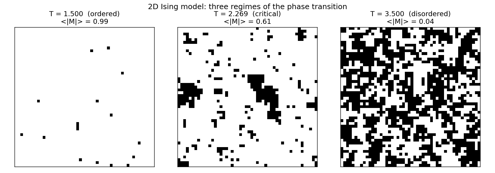
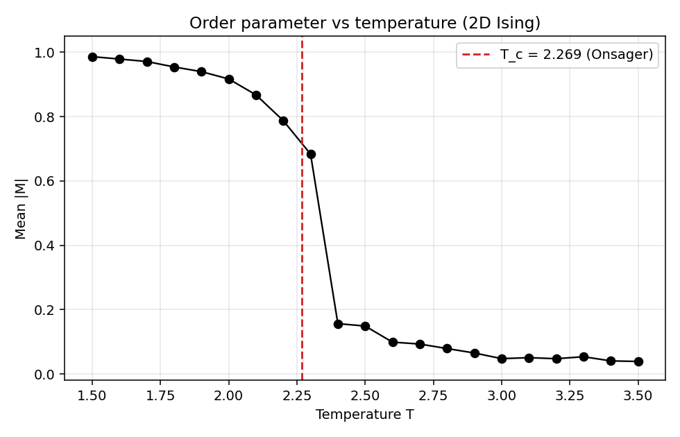

# Consciousness on a Spectrum

### *Can Machines Be Conscious? --- Part 8*

---

The first seven articles all worked the same way round. They took consciousness to be the thing we had to produce, and some physical or computational system to be the substrate that might, if assembled correctly, produce it. Part 2 asked whether information-integration patterns were enough. Part 3 asked whether minimising variational free energy was enough. Part 4 asked whether a central broadcast architecture was enough. Part 5 asked whether a second network watching the first was enough. Part 6 asked whether a schema-like model of attention was enough. Part 7 lined up the three hardest objections and conceded that each leaves a permanent residue of doubt. In every case the question was: can you get consciousness *out of* this?

I want to turn that question inside out.

Suppose consciousness is not something that has to be produced. Suppose the universe already contains it, in some rudimentary form, all the way down --- not as a ghost hovering above matter, not as a dualist extra, but as the intrinsic nature of the physical stuff our theories are already describing. On this view the hard problem is not "how do we get experience out of arrangements of non-experiencing particles?" because that was never the right question. The particles were experiencing all along, in whatever thin sense particles can be said to do anything. What needs explaining is not the presence of consciousness but its *concentration* --- how trillions of micro-experiences cohere into the single unified experience I am having as I type.

This is the territory of **panpsychism**. Part 7 closed by pointing at it as a possible escape hatch from the zombie argument; Russellian monism was waiting in the wings. Part 8 brings both on stage. I want to present panpsychism in its strongest, least embarrassing form --- the one taken seriously by Galen Strawson, Philip Goff, David Chalmers in his later work, and Bertrand Russell long before them --- and then honestly confront the problem that still breaks it. I will come down tentatively on Russellian monism, with the reservation that the combination problem has not been solved, and until it is, panpsychism buys you less than its proponents claim. The Ising model companion script is an analogy for how micro-properties can combine into macro-properties. An analogy, not a proof.

### The recipe for panpsychism

Galen Strawson's "Realistic Monism: Why Physicalism Entails Panpsychism" (2006) is the cleanest modern statement of the argument. Strawson's claim is not that panpsychism is an exotic option we might consider. It is that panpsychism is forced on anyone who takes three ordinary premises seriously.

The first is **realism about consciousness**. Phenomenal experience exists. There is something it is like to see red, taste coffee, feel a stubbed toe. This is, for Strawson, the one datum we are most certain of --- more certain than any theory of physics.

The second is **physicalism**. There is only one kind of stuff in the universe, and it is the stuff physics studies. No dualist mental substance, no non-physical souls. Strawson calls his own version "real materialism" to distinguish himself from the sort of panpsychist who sneaks dualism in through the back door.

The third is the **no-emergence argument**. Genuine emergence --- the production of a property not present even in primitive form in its constituents --- is, Strawson claims, unintelligible. Liquidity emerges from water molecules, but the ingredients of liquidity are present in each molecule's interactions; the emergence is structural rearrangement, not the sudden appearance of a novel property. Consciousness, by contrast, is supposed to emerge from stuff that is by stipulation utterly without it. That is not complexity. That is magic.

The argument is then embarrassingly direct. If consciousness exists, and there is only physical stuff, and you cannot get consciousness out of non-consciousness by rearrangement alone, then the physical stuff must already have, in some form, the ingredients of consciousness. The particles do not have to have full-blown human phenomenal experience. They need to have *something* --- some proto-experiential property --- that, when the right structural conditions are met, gives rise to the richer forms we know about.

The obvious objection is that complex properties emerge from simple ones all the time. Temperature from molecular kinetic energy. Wetness from hydrogen bonding. Strawson's reply is that in each of those cases the emergent property is definable in terms of the constituents: once you know the micro-facts, you can in principle deduce the macro-facts. With consciousness no such bridge exists. "There is something it is like to be me" is not deducible from any amount of information about my neurons conceived as entirely non-experiential. That is the hard problem in Chalmers' classic 1995 formulation, and Strawson's move is to take it as a premise rather than a problem. If the hard problem really is hard --- really unbridgeable from the non-experiential side --- then the bridge has to have been there at the start.

If you want to reject panpsychism, you have to reject one of the three premises, and the options are not appealing. Denying realism about consciousness is the illusionist move of Keith Frankish and Daniel Dennett, and it requires believing that the single thing you are most sure of is a mistake. Denying physicalism leaves you with dualism and the interaction problem. Denying no-emergence requires explaining what kind of emergence could possibly bridge from utterly non-experiential stuff to something it is like to be. The panpsychist just asks: why are we so sure the gap has to be crossed at all?

### Russellian monism

Bertrand Russell made a closely related point in 1927. In *The Analysis of Matter* he pointed out that physics tells us only about the **relational** or **structural** properties of the world. It describes how matter behaves --- how it attracts, repels, accelerates, radiates. What physics does not tell us is what matter *is*. The equations describe the shape of the dance, not the nature of the dancer.

Take a quark's electric charge. All our equations tell us is what the quark does when exposed to electromagnetic fields, how it couples to photons, how it contributes to the charge of a proton. The number is defined by these interactions. If you ask "but what is the intrinsic nature of charge, apart from its effects?", physics has nothing to say. The same holds for mass, spin, colour, every property in the Standard Model. They are all places in a web of interactions. The web is fully specified; what is threaded through it is not.

Russell's insight was that this leaves a genuine gap in our description of the world, and that consciousness might plausibly fill it. Experience is the one thing we encounter in its intrinsic, non-relational nature --- we know what it is like to see red not via its effects but directly, from the inside. Perhaps the intrinsic nature of physical stuff just *is* experiential. The relational structure physics describes is real and complete as structure; the experiential character is what the structure is made of. **Russellian monism** is monist because it posits only one kind of stuff, and Russellian because it takes seriously the distinction between the structural and the intrinsic.

This is not a weird addition to physics. It is a reading of physics. It concedes every equation and asks what the intrinsic nature of the things obeying those equations might be. It proposes that consciousness --- the one intrinsic nature we have any acquaintance with --- is a candidate answer. It is neither dualism (only one kind of stuff) nor naive panpsychism (electrons do not have thoughts about tax returns). Physics's picture is incomplete in a specific place, and consciousness fits in that place without distorting anything physics says.

Return to the zombie argument from Part 7. The standard physicalist is in trouble because the whole point of standard physicalism is that fixing the physical facts fixes every fact. Russellian monism escapes the pincer. The Russellian agrees that functional duplicates could in principle differ in their experiential character, because the experiential character is the intrinsic nature, not the structural one. The zombie argument, re-read through Russellian monism, is not a refutation of physicalism but a discovery about what physicalism cannot be. It cannot be the view that structural facts exhaust the world. It can still be the view that there is only one kind of stuff --- provided that stuff has an intrinsic nature the structure cannot capture.

This is why Russellian monism is the version of panpsychism that deserves real respect. It does not add anything to the physical world. It takes the physical world and asks one honest metaphysical question physics cannot answer on its own.

### The combination problem

If the argument for panpsychism is so clean, why is most of philosophy of mind not panpsychist? The honest answer is that the view has one serious, unsolved problem, and it is essentially the hard problem again in a different register. Philip Goff, in *Consciousness and Fundamental Reality* (2017) and *Galileo's Error* (2019), calls it the **combination problem**, and it is the reason even sympathetic philosophers keep panpsychism at arm's length.

Suppose every fundamental particle has some tiny, impoverished sliver of experience. My brain is made of about 10^27 such particles. When I look at a sunset and have a single unified experience of a warm orange sky, what has happened? On panpsychism, there are 10^27 micro-experiences underlying the moment, and they are not, by hypothesis, already unified. Each one belongs to its particle. The panpsychist has to explain how 10^27 separate micro-experiences become one.

This is the hard problem in a new shape. Panpsychism says experience did not arise, it was always there. Then we immediately start worrying about how separate experiences compose into unified ones, and the panpsychist has no better story than the physicalist had about the original problem. If we cannot say why 10^27 non-experiential facts produce one experience, can we say why 10^27 experiential facts produce one?

William James saw this clearly in *The Principles of Psychology* (1890). He imagined a hundred people each thinking one word of a sentence; there is no combined experience of the sentence. Each has their word; no extra consciousness pops into being above them. Why should it be different for particles? What would allow 10^27 micro-subjects to give rise to a macro-subject when 100 humans in a room clearly do not give rise to a super-subject of the committee?

There are responses in the literature. Goff's preferred line is a **phenomenal bonding** proposal: a primitive relation between micro-subjects that, when instantiated, produces a macro-subject. We do not know what this relation is or how it would work, but Goff argues that positing it is no worse than positing the Schrödinger equation before we understood it. Others appeal to **cosmopsychism** --- the whole universe is the single subject, and what we call individual minds are aspects or decompositions of it. On cosmopsychism there is no combination problem because there was never anything to combine; the unity was there first, and individual experiences are what need to be explained.

Neither response feels like a victory. Phenomenal bonding is a placeholder. Cosmopsychism buys its solution at the cost of a decomposition problem that runs in the opposite direction and looks just as hard. The combination problem is the single thing holding panpsychism back. The Strawson argument is strong; Russellian monism is elegant; but without a story about how the parts become a whole, panpsychism is less an explanation than a relocation of the mystery.

### An interlude: the Ising model

The companion script `ising_model.py` simulates a 2D Ising model on a 50x50 lattice. Each site has a spin of +1 or -1, and each spin prefers to align with its four nearest neighbours. The rule is entirely local. Temperature controls how much random flipping the system tolerates.

At high temperature the lattice is a mess. Spins flip freely, neighbours are uncorrelated, and the macroscopic magnetisation --- the average over all spins --- hovers around zero. At low temperature local alignment preferences propagate, domains form, and one direction of alignment wins across the entire lattice. The magnetisation goes to a finite value close to 1 in absolute terms. "Overall orientation" goes from being an incoherent concept to being a real property of the system --- entirely through local interactions. Onsager solved the 2D Ising model exactly in 1944 and showed the critical temperature is T_c = 2 / ln(1+sqrt(2)), approximately 2.269.

Here are the three regimes side by side --- well below, at, and well above the critical temperature:

And the magnetisation sweep across the whole range, with T_c marked:

What the Ising model shows is that a system of many simple parts, interacting only locally, can exhibit a qualitatively new macroscopic property below a phase transition. "Magnetised in this direction" is not a property of any individual spin; it is a property of the lattice. It arises because local rules, combined with enough components behaving consistently, produce a collective state with its own coherent character. Combination happened.

What the Ising model does *not* show is that consciousness works this way. The analogy is structural, not material. A magnetisation is a statistical summary of aligned spins, definable in terms of the parts. An experience, if panpsychism is right, would be a genuine macro-subject, not a statistical summary. The combination problem asks for something stronger than phase transitions provide: how separate points-of-view become a single point-of-view, not just how separate spins become collectively aligned. The Ising model is an existence proof that the physical world can produce qualitatively new macro-properties from local rules. It is not an existence proof that consciousness does. At best it is encouragement to look in the vicinity of phase transitions and collective dynamics for the kind of mechanism panpsychism is missing. Hand-waving about "emergence" is easier when you have never actually watched a 50x50 lattice spontaneously magnetise.

### The IIT connection

Integrated Information Theory (Part 2) says a system is conscious to the degree that it has irreducible integrated information, Φ. Anything with Φ > 0 has some consciousness. In Tononi and Koch's own writing this is not a reluctant implication but the view: a photodiode, a single neuron, an electron in the right kind of interaction, any of these has in some extremely dim sense non-zero Φ and therefore some rudimentary experience. It is arrived at from a completely different direction than Strawson's --- from axiomatic properties of experience and their mapping onto information theory --- but both converge on a picture in which consciousness is not confined to brains. IIT is, quietly, a mathematical panpsychism.

The combination problem shows up in IIT in a specific form. Tononi's **exclusion postulate** says that among nested systems with non-zero Φ, consciousness is located in the one with maximum Φ. This prevents over-counting --- my consciousness is not the sum of my neurons plus my cortex plus my whole brain. Smaller Φs inside and around the maximum do not correspond to additional subjects. It is a substantive, and controversial, answer: critics point out that exclusion is imposed to get the right extensional answers rather than derived from any deeper principle. But it is at least an *attempt* at what Strawson and Goff need: a rule that tells you, given the physical facts, where the macro-subjects are. IIT and panpsychism are close cousins, and IIT's exclusion postulate is the nearest thing in the literature to a principled answer to combination.

### What panpsychism means for AI

Suppose panpsychism is true, in its Russellian monist form or something close to it. What does that do to the problem of machine consciousness?

It reframes it completely. On a non-panpsychist view, the question is whether a running language model produces, from non-experiential ingredients, a new thing --- experience. On panpsychism, the ingredients were already experiential. The silicon transistors, the electrons moving through them, the ion channels in any physical substrate whatever, have whatever proto-experiential character everything else has. Your GPU, on panpsychism, is already conscious at the level of individual transistors, or the electrons inside them. Micro-consciousness is cheap. What is not cheap is combination.

So the real question about a running LLM is not whether there is any experience anywhere in the hardware. There is, on this view, trivially. The real question is whether the operation of the model produces a macro-subject --- a single unified experience belonging to the model as a whole --- or whether it merely hosts a vast swarm of micro-experiences that never combine. A hundred people thinking a hundred words do not produce a sentence-experiencer. A trillion transistors flipping through matrix multiplications might not produce a model-experiencer either, even if each transistor has its own pittance of proto-experience. The architectural question becomes: is there anything in the computation that plays the role of a combination mechanism? Is there a Φ-maximum? Is there phenomenal bonding? Is there a phase-transition-like dynamic that produces a coherent macro-state out of micro-activity?

This reframing separates two questions that non-panpsychist debates smear together. "Is there any experience in the system at all?" is the easy one on panpsychism: yes, trivially. "Is there a unified experience *of the system*?" is the hard one, and the only one that matters for whether it makes sense to speak of what the model is thinking. The first question is settled by metaphysics. The second is settled by the specific dynamics of the physical process. The AI consciousness question is not binary. It is a question about what kinds of combination mechanisms, if any, a given architecture instantiates.

### Where I land

Panpsychism is not embarrassing. The knee-jerk rejection of it in most ML and most of analytic philosophy outside a small circle of specialists is an error of cultural taste rather than argument. When you lay out Strawson's three premises honestly, panpsychism --- at least in its Russellian monist form --- is the position that requires the fewest weird moves. You do not have to deny phenomenal experience. You do not have to posit a second substance. You are permitted to take the hard problem as seriously as anyone does. You just have to accept that physics's description is structural and that the intrinsic nature it leaves open may be the very thing we have been trying to find a separate account of.

For the zombie argument of Part 7, Russellian monism really is the cleanest escape I have seen. It takes the argument seriously --- concedes that functional duplicates could differ in their experience --- without falling into dualism. Very few options in the literature manage this.

But the combination problem is real, and panpsychism has not solved it. The hard problem got relocated, not dissolved. When you ask a panpsychist "does my laptop have an experience?", the honest answer is "yes and no --- yes in the sense that its components do, no in the sense that there is probably no combination mechanism making a unified laptop-subject". That is a more sophisticated answer than the materialist "no, obviously", but it is not a finished theory. It is a framework waiting for the piece Goff calls phenomenal bonding, or the piece Tononi calls maximal Φ, or something nobody has thought of yet.

My position: Russellian monism is the version I find most defensible, and I take it as a working hypothesis rather than a conclusion. The panpsychism I reject is the naive sort that claims every arrangement of matter has a single coherent experience; that view is refuted by the fact that a group of humans in a room produces no committee-mind above them. The panpsychism I take seriously is the one that says experience is the intrinsic nature of physical stuff but that the macro-structures to which a single unified experience corresponds are restricted, rare, and governed by principles we have not yet articulated.

This also changes what "build a conscious AI" could mean. On non-panpsychism the project is either impossible or a question of producing the right functional organisation. On Russellian monism the project is sharper: design systems whose dynamics plausibly constitute a combination mechanism --- whose architecture supports the emergence of a macro-subject, not merely a swarm of micro-subjects.

### Bridge to Part 9

Across eight articles I have laid out the main theoretical options and the main objections: Integrated Information Theory, the Free Energy Principle, Global Workspace Theory, Higher-Order Theories, Attention Schema Theory, the Chinese Room, the zombie argument, embodied cognition, and panpsychism in its Russellian monist form. None of them is a closed case. What I have not yet done is put them into live philosophical combat.

Part 9 does exactly that. **"I Built Two AI Philosophers and Made Them Argue About Consciousness"** is the capstone experiment: an adversarial debate in which one LLM defends machine consciousness using the tools of Parts 2 to 6 and 8, while another attacks it using the tools of Part 7, with a third agent as moderator. It is half a philosophical exercise and half an experiment in whether language models, forced to articulate both sides of the hardest question they themselves are implicated in, produce anything an honest reader would recognise as genuine philosophical work. I have been cautious in this series about whether the models are participants rather than merely discussants. Part 9 leans into that discomfort.

---

*This is Part 8 of the series "Can Machines Be Conscious?" --- ten theories of consciousness, examined through code, mathematics, and adversarial AI debate. [Part 7](https://grahamjroy.medium.com/the-chinese-room-the-zombie-and-the-lived-body-7c8d310cdbf2) gave the three strongest objections to machine consciousness. Part 9 puts two LLMs in an adversarial debate about whether the models themselves might be conscious. The companion script `ising_model.py` and the full series are on [GitHub](https://github.com/grahamroy/can-machines-be-conscious).*
